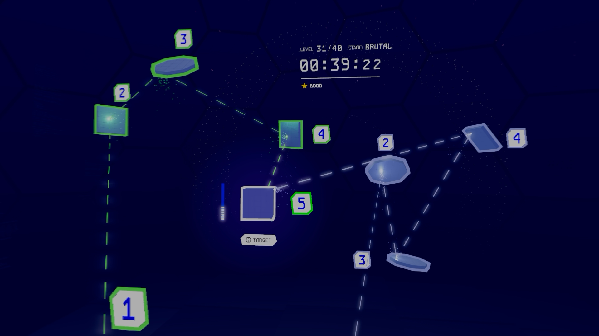

# Rendering 3D graphics on Apple Vision with the Metal API

1. Introduction
   1. `Metal` API
   2. `Compositor Services` API
2. Dissecting a Frame of RAYQUEST
3. Stereoscoping Rendering
   1. Organization of the `Compositor Services` textures you use for drawing   
   2. Vertex Amplification
   3. Computing the View Matrices for Each Eye
   4. Variable Rate Rasterization (Foveation)
5. Pre-Rendering Tasks
   1. Compute
   2. Animation / Tweening
   3. Frame Prediction
      1. Querying the Next Frame
      2. Waiting Until Optimal Rendering Time
      3. Frame Submission
6. Base / Forward MSAA Pass
   1. Opaque Objects
   2. Skybox
   3. Transparent Objects
   4. Resolving MSAA Texture
7. Bloom Pass
8. Composite Pass
9. Passthrough Rendering

## Introduction

Apple Vision Pro has been out for 7 months at the time of writing this article. Many games have been released for it since then and more and more game developers enter this niche. When it comes to rendering, most developers jump to an existing game engine such as Unity or use Apple's high level rendering APIs such as RealityKit. However a third way exists, one that has been there since visionOS 1.0 - rolling your own rendering engine using the Metal API. While challenging, this method is incredibly rewarding and gives you complete control over the entire rendering pipeline down to each individual byte and command submitted to the GPU.

> **_NOTE:_**  visionOS 2.0 allows us to render graphics via the Metal API and overlay (composite) them in **mixed** mode with the user's surroundings caputed by the device cameras' feed. This article focuses on writing Metal apps for fully **immersive** mode, although passthrough rendering will be mentioned at the end.

### Metal API

Taken directly from Apple's official website:

> Metal is a modern, tightly integrated graphics and compute API coupled with a powerful shading language that is designed and optimized for Apple platforms. Its low-overhead model gives you direct control over each task the GPU performs, enabling you to maximize the efficiency of your graphics and compute software. Metal also includes an unparalleled suite of GPU profiling and debugging tools to help you improve performance and graphics quality.

I will not focus too much on the intristics of Metal in this article, however will mention that the API is mature, well documented and **incredibly nice** to work with. It is more explicit than an API such as OpenGL ES, there is more planning involved in setting up your rendering pipeline, but is still more beginner friendly then, say, Vulkan or DirectX12. Furthermore, Xcode's built-in Metal profiler and debugger are hands down the best tools to debug and inspect computer graphics I have seen so far.

### Compositor Services

Compositor Services is visionOS-specific API that lets you draw directly to the Apple Vision Pro displays (one for each eye). It provides a bridge between your SwiftUI code and your Metal rendering engine code by giving you a layer, which contains the Metal types, textures, and other information you need. This layer also provides timing information to help you manage your app’s rendering loop and deliver frames of content in a timely manner.

## Dissecting a Frame of RAYQUEST

[RAYQUEST](https://rayquestgame.com/) is my first game published on Apple Vision. It utilises Compositor Services and Metal to deliver advanced graphics at 4K resolution at 90 frames per second. This article will take one random frame of it captured during gameplay and show you how is it rendered by taking you on a trip through the complete rendering pipeline.

So here is the frame we will examine:

### Stereoscoping Rendering

First thing we need to realize is that unlike traditional apps where we render to a single device screen, be it on your MacBook or iPhone, on Apple Vision we need to render to two displays - one for the left eye and one for the right eye.
